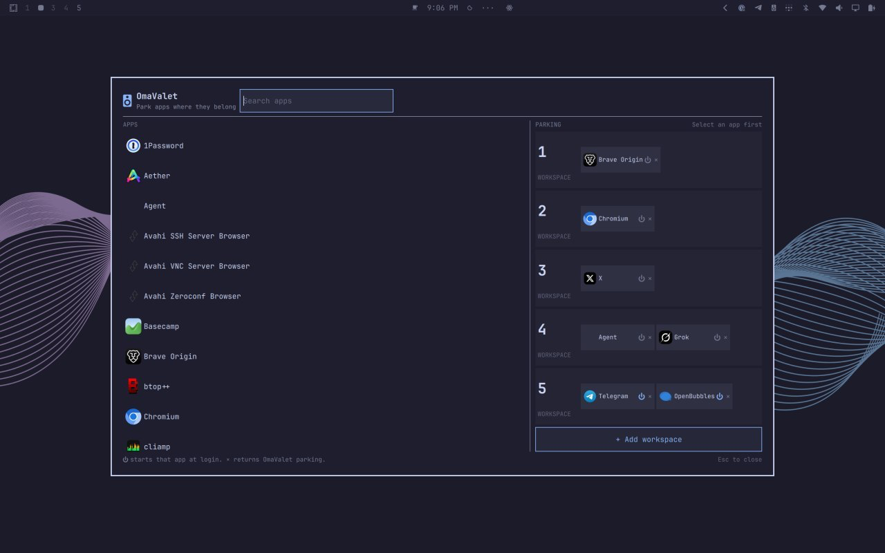

# OmaValet

**Park apps in the Omarchy workspaces where they belong.**

OmaValet is a minimal, theme-aware workspace valet for Omarchy Quattro. It shows applications by their desktop name and icon, displays existing Hyprland workspace assignments, and lets you assign apps to workspaces without hand-editing Lua. Placement is the default. Launch-at-login is optional and off by default.



## Features

- Search installed desktop applications by name, including Omarchy **Agent** (`Super+Ctrl+Shift+A`).
- See five workspace parking lanes at a glance, matching Omarchy's default.
- Park more than one app in the same workspace.
- Add extra workspaces with **+ Add workspace** (up to 10), and remove empty extras with **− Remove workspace** down to five.
- Click an app, then click a workspace (or **+ Park**) to park it there.
- Opening a parked app switches to its workspace. **⏻** login start does not steal the current workspace.
- See existing Hyprland assignments as locked, read-only entries.
- Remove OmaValet-owned assignments with **×**.
- Optionally start a parked app at login with **⏻** (off by default).
- Press **Esc** to close (first press clears search if it has text).
- Match real window classes from StartupWMClass, desktop id, and Flatpak `--command=` so apps land on the right workspace.
- Follow the active Omarchy theme through its native `Color`, `Style`, and `Border` tokens.
- Generate deterministic Hyprland Lua without rewriting `autostart.lua`.
- Back up `hyprland.lua` before adding the reversible loader block.

## Requirements

- Omarchy Quattro (Omarchy 4)
- Python 3

OmaValet uses only the Python standard library. It does not require root and does not launch a second Quickshell process.

## Install

```bash
omarchy plugin add https://github.com/jcarcinogen/OmaValet.git --enable
```

The plugin appears on the right side of the Omarchy bar. Click its icon to open the parking board.

## Use

1. Open **OmaValet** from the bar.
2. Search for and select an application.
3. Click the workspace where the valet should park it, or **+ Park** on a lane that already has apps.
4. Use **+ Add workspace** under the lanes if you need a workspace past the five Omarchy shows by default. Use **− Remove workspace** to drop an empty extra lane. Five lanes always remain.
5. Remove an OmaValet assignment by clicking its **×**.
6. Click **⏻** on a parked app if you also want it to start at login. Login start stays on that workspace without switching away from wherever you are.
7. Press **Esc** to close.

Locked entries come from existing user-authored Hyprland rules. OmaValet shows them for context but does not overwrite or remove them.

## What OmaValet writes

OmaValet does not edit `~/.config/hypr/autostart.lua`. Placement is the default; login launch is opt-in:

- `~/.config/omarchy/omavalet.json` — OmaValet-owned assignments
- `~/.config/hypr/omavalet.lua` — generated `o.window(...)` rules (follow the workspace on a normal launch). When **⏻** is on, also `o.exec_on_start("[workspace N silent] uwsm-app -- …")`
- `~/.config/hypr/hyprland.lua.omavalet.bak` — first-write backup
- a marked `require("hypr.omavalet")` block in `~/.config/hypr/hyprland.lua`

Parked apps go to their workspace when you open them. They start at login only if you turn **⏻** on, and that start is silent.

## Remove

Reset OmaValet first so its generated state and marked loader are removed safely:

```bash
PLUGIN_DIR="$HOME/.config/omarchy/plugins/io.github.jcarcinogen.omavalet"
python3 "$PLUGIN_DIR/scripts/omavalet.py" reset
omarchy plugin remove io.github.jcarcinogen.omavalet
```

If reset reports `"backupPreserved": true`, OmaValet detected that the current Hyprland configuration no longer matches its original backup. The backup is deliberately left at:

```text
~/.config/hypr/hyprland.lua.omavalet.bak
```

Review it before deleting it. Reset never replaces later user changes with the backup.

## Development

Run the Python tests:

```bash
python3 -m unittest discover -s tests -v
```

Validate the plugin on Omarchy:

```bash
omarchy plugin validate .
```

The plugin id is `io.github.jcarcinogen.omavalet`.

## Current scope

- Workspaces 1–5 are shown by default, matching Omarchy. Extra lanes appear if you already park there, or when you click **+ Add workspace** (up to 10). Empty extras can be removed down to five.
- Existing assignments found in `hyprland.lua` and `windows.lua` are read-only.
- Application identity comes from freedesktop desktop files plus live class aliases (StartupWMClass, desktop stem, Flatpak `--command=`). Omarchy Agent is included even without a `.desktop` launcher.

## License

MIT
